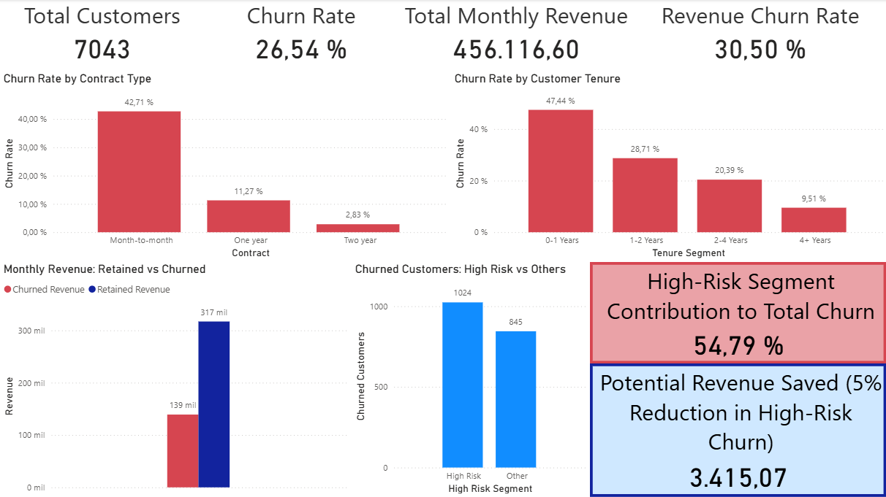

# Reducing Revenue Loss: A Business-Driven Churn Analysis

## 📌 Project Overview

A telecommunications company is experiencing a churn rate of 26.5%, resulting in a 30.5% monthly revenue loss.  
The objective of this analysis is to identify the primary drivers of customer churn and determine high-impact segments where retention efforts can significantly reduce revenue loss.

This project is developed from a Data Analyst perspective, focusing on business insights, segmentation, and financial impact rather than predictive modeling.

---

## 🎯 Business Problem

Customer churn represents a significant threat to recurring revenue in subscription-based businesses.  

The key questions addressed in this analysis are:

- What is the current churn rate and revenue impact?
- Which customer segments have the highest churn?
- Is revenue loss proportional to customer loss?
- Where should the company focus retention strategies?

---

## 📊 Dataset

- Source: IBM Telco Customer Churn Dataset  
- Total records: 3,974 customers  
- Key variables:
  - Contract type
  - Tenure
  - Monthly charges
  - Customer demographics
  - Service usage
  - Churn status

---

## 🛠 Tools & Technologies

- **Python (Pandas)** → Data cleaning and preparation  
- **SQL (via SQLite / SQL queries)** → Exploratory data analysis  
- **Power BI** → KPI modeling and business dashboard creation  

---

## 🔎 Methodology

1. Data cleaning and validation in Python  
2. SQL-based exploratory analysis to compute KPIs and segment metrics  
3. Churn rate calculation by contract and tenure  
4. Revenue churn analysis  
5. Segment concentration analysis (High-Risk segment identification)  
6. Business dashboard design in Power BI  

---

## 📈 Key Findings

- Overall churn rate: **26.54%**
- Revenue churn rate: **30.5%**
- Customers who churn pay more on average ($74.44) than retained customers ($61.27)
- Month-to-month contracts show the highest churn rate (42.71%)
- Customers with ≤ 1 year tenure show a churn rate of 47.44%
- 54.79% of total churned revenue comes from early-stage month-to-month customers

---

## 💡 Business Insights

Churn is highly concentrated among:

- Customers with short tenure
- Customers on month-to-month contracts

Additionally, revenue churn exceeds customer churn, indicating that higher-paying customers are disproportionately leaving.

This suggests that low-commitment customers represent the highest financial risk.

---

## 📌 Strategic Recommendation

Retention strategies should prioritize early-stage, month-to-month customers through:

- Contract incentives
- Improved onboarding processes
- Early engagement programs

Targeting this segment could significantly reduce monthly revenue loss.

---

## 📊 Dashboard

The Power BI dashboard includes:

- KPI overview (Customers, Churn Rate, Revenue Impact)
- Churn by Contract Type
- Churn by Tenure Segment
- Revenue Retained vs Churned
- High-Risk Segment Contribution

## 📊 Dashboard Preview

  

---

## 🚀 Project Outcome

This project demonstrates:

- KPI modeling
- SQL-based segmentation analysis
- Revenue impact evaluation
- Business-driven storytelling
- Dashboard design for executive decision-making

The analysis focuses on turning raw data into actionable business insights.